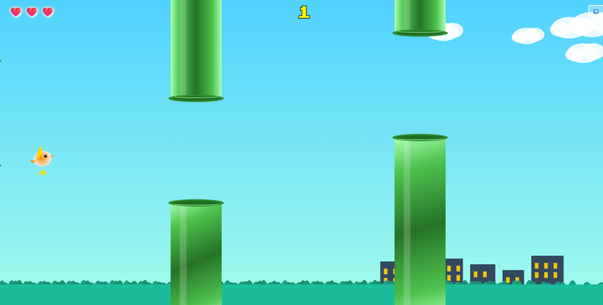

# 🐦 Flappy Ai Bird

An AI-coded tribute to Flappy Bird—playful, browser-ready, and built entirely through natural language prompts using GitHub Copilot in Visual Studio Code.  
No manual code. Just creativity, curiosity, and a co-pilot.

> 📝 Even this README and the [`PROMPTS.md`](docs/PROMPTS.md) file were created using Copilot—guided by prompts, not typing.

---

## 📸 Play Game

[▶️ Play the game now](https://code20.github.io/flappy-ai-bird/)

---

## 💡 What Is This?

This project started as a bold “no-code coding” challenge:  
Can Copilot build a fully functional browser game with nothing but well-crafted prompts?

**The challenge: no typing—just conversational instructions.**  
The result: a polished take on Flappy Bird with animations, custom mechanics, and AI-inspired flair.

### 🔧 Tech Stack

- HTML5 + Canvas
- CSS3 for styling and animation
- JavaScript (ES6 modules)
- GitHub Copilot in VS Code
- [Live Server](https://marketplace.visualstudio.com/items?itemName=ritwickdey.LiveServer) for testing

---

## 🚀 Features

- 🔁 Entirely prompt-generated: code, logic, and visuals
- 🖼️ Responsive canvas with fluid UI
- ⛅ Animated parallax clouds and layered background
- 🔊 Sound effects for jump, hit, and score events
- 💾 LocalStorage-based best score tracking
- ✨ Particle effects and visual polish
- ⏸️ Pause/resume, lives, and game state handling

---

## 🎮 How to Play

- Press **[Space]** or **Click/Tap** to flap
- Avoid pipes and statues
- Earn points by staying alive
- Press **[P]** or the pause icon to pause/resume
- Press **[M]** or the sound icon to mute/unmute sounds
- Your best score will be remembered!

---

## 🧪 Why This Exists

- 🧠 Test Copilot’s real-world creative potential
- 🎨 Explore prompt-driven development in an interactive domain
- 🛠️ Push Copilot into designing, fixing, and iterating on features
- 📖 Open-source the journey so others can follow, remix, or build on it

You can view all instructions and prompts used in [`PROMPTS.md`](docs/PROMPTS.md).

---

## 💬 Example Prompts Used

Here are just a few of the natural language prompts that shaped the game:

### 🏗️ Game Structure & Logic
- "Create a Flappy Bird clone using HTML5 Canvas and JavaScript."
- "Make pipes appear at random heights and move from right to left."
- "Add a new obstacle type called 'statue' that behaves differently from pipes."
- "Track and display the best score using localStorage."

### 🎮 Controls & Feedback
- "Make the bird flap when the spacebar is pressed or the canvas is clicked."
- "Implement a pause/resume feature with a button and keyboard shortcut."
- "Add a mute/unmute feature with a button and keyboard shortcut."
- "Add a start screen and a game over screen with restart button."

### 🎨 Design & Effects
- "Add a parallax background with animated clouds."
- "Show hearts for lives remaining in the top-left corner."
- "Show a particle effect when the bird jumps or hits something."
- "Style the pause and mute buttons to look modern and consistent."

### 🐞 Fixes & Iteration
- "Fix the bug where the game over screen doesn't show after losing all lives."
- "Adjust the collision detection so the bird can't clip through pipes."
- "Fix conflicts between keyboard shortcuts for pause and mute features."

---

## ✍️ Credits

- **Concept, design, and prompt authoring**: [code20](https://github.com/code20)  
- **Code generation**: GitHub Copilot in VS Code
